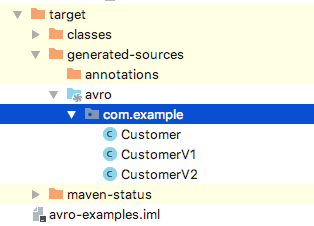

# avro-examples

### Run GenericRecordExamples.java
```

SLF4J: Failed to load class "org.slf4j.impl.StaticLoggerBinder".
SLF4J: Defaulting to no-operation (NOP) logger implementation
SLF4J: See http://www.slf4j.org/codes.html#StaticLoggerBinder for further details.
{"first_name": "John", "last_name": "Doe", "age": 26, "height": 175.0, "weight": 70.5, "automated_email": false}
{"first_name": "John", "last_name": "Doe", "age": 26, "height": 175.0, "weight": 70.5, "automated_email": true}
Generic Record build did not succeed
org.apache.avro.AvroRuntimeException: Field first_name type:STRING pos:0 not set and has no default value
	at org.apache.avro.generic.GenericData.getDefaultValue(GenericData.java:1015)
	at org.apache.avro.data.RecordBuilderBase.defaultValue(RecordBuilderBase.java:138)
	at org.apache.avro.generic.GenericRecordBuilder.getWithDefault(GenericRecordBuilder.java:232)
	at org.apache.avro.generic.GenericRecordBuilder.build(GenericRecordBuilder.java:209)
	at com.github.simplesteph.avro.generic.GenericRecordExamples.main(GenericRecordExamples.java:67)
Written customer-generic.avro
Successfully read avro file
{"first_name": "John", "last_name": "Doe", "age": 26, "height": 175.0, "weight": 70.5, "automated_email": false}
First name: John
Non existent field: null

```

### mvn compile



### RUN SpecificRecordExamples.java

```

SLF4J: Failed to load class "org.slf4j.impl.StaticLoggerBinder".
SLF4J: Defaulting to no-operation (NOP) logger implementation
SLF4J: See http://www.slf4j.org/codes.html#StaticLoggerBinder for further details.
{"first_name": "Mark", "last_name": "Simpson", "age": 30, "height": 180.0, "weight": 90.0, "automated_email": true}
successfully wrote customer-specific.avro
Reading our specific record
{"first_name": "Mark", "last_name": "Simpson", "age": 30, "height": 180.0, "weight": 90.0, "automated_email": true}
First name: Mark
Reading our specific record
{"first_name": "John", "last_name": "Doe", "age": 26, "height": 175.0, "weight": 70.5, "automated_email": false}

```

### RUN ReflectionExamples.java
```
schema = {
  "type" : "record",
  "name" : "ReflectedCustomer",
  "namespace" : "com.github.simplesteph.avro.reflection",
  "fields" : [ {
    "name" : "firstName",
    "type" : "string"
  }, {
    "name" : "lastName",
    "type" : "string"
  }, {
    "name" : "nickName",
    "type" : [ "null", "string" ],
    "default" : null
  } ]
}
Writing customer-reflected.avro
Reading customer-reflected.avro
SLF4J: Failed to load class "org.slf4j.impl.StaticLoggerBinder".
SLF4J: Defaulting to no-operation (NOP) logger implementation
SLF4J: See http://www.slf4j.org/codes.html#StaticLoggerBinder for further details.
Bill Clark The Rocket

```


### RUN SchemaEvolutionExamples.java

````
SLF4J: Failed to load class "org.slf4j.impl.StaticLoggerBinder".
SLF4J: Defaulting to no-operation (NOP) logger implementation
SLF4J: See http://www.slf4j.org/codes.html#StaticLoggerBinder for further details.
Customer V1 = {"first_name": "John", "last_name": "Doe", "age": 34, "height": 178.0, "weight": 75.0, "automated_email": false}
successfully wrote customerV1.avro
Reading our customerV1.avro with v2 schema
Customer V2 = {"first_name": "John", "last_name": "Doe", "age": 34, "height": 178.0, "weight": 75.0, "phone_number": null, "email": "missing@example.com"}
Backward schema evolution successful


Customer V2 = {"first_name": "Mark", "last_name": "Simpson", "age": 25, "height": 160.0, "weight": 65.0, "phone_number": "123-456-7890", "email": "mark.simpson@gmail.com"}
successfully wrote customerV2.avro
Reading our customerV2.avro with v1 schema
Customer V1 = {"first_name": "Mark", "last_name": "Simpson", "age": 25, "height": 160.0, "weight": 65.0, "automated_email": true}
Forward schema evolution successful

````