# REST-Proxy


### Start docker kafka
```
docker-compose up
```

### Connect to kafka
docker run --rm -it -v "$(pwd)":/tutorial --net=host landoop/fast-data-dev bash

### Create topics
```
kafka-topics --create --zookeeper localhost:2181 --topic rest-binary --replication-factor 1 --partitions 1
kafka-topics --create --zookeeper localhost:2181 --topic rest-json --replication-factor 1 --partitions 1
kafka-topics --create --zookeeper localhost:2181 --topic rest-avro --replication-factor 1 --partitions 1

```

### Import the rest-proxy-insomnia.json

### Get topic config
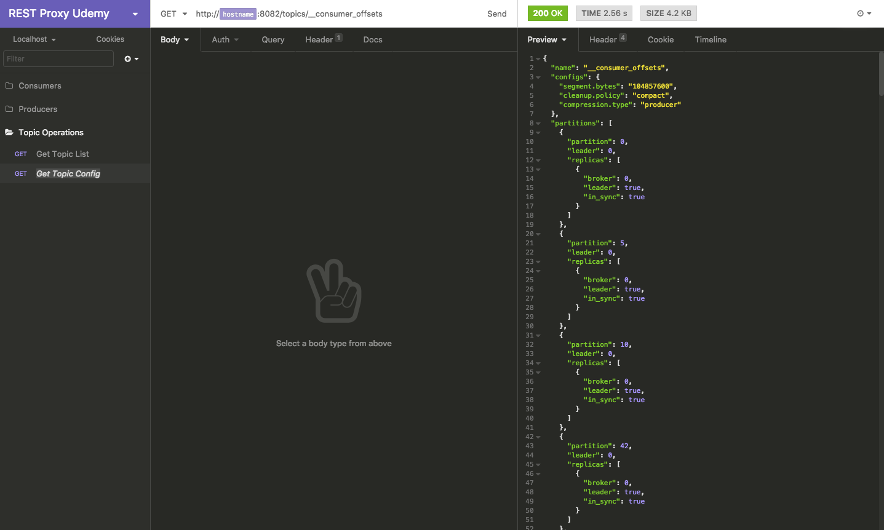

### Producer Binary
- Send binary
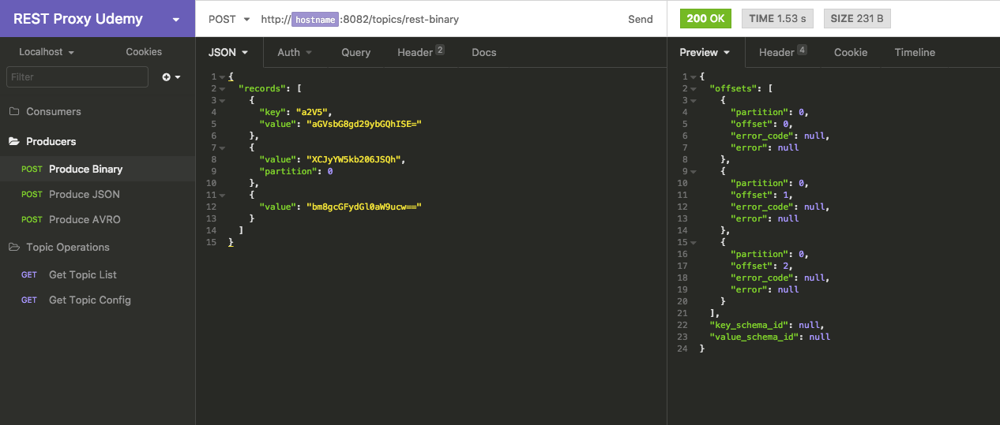

- Data in topic binary http://localhost:3030/kafka-topics-ui/#/cluster/fast-data-dev/topic/n/rest-binary/
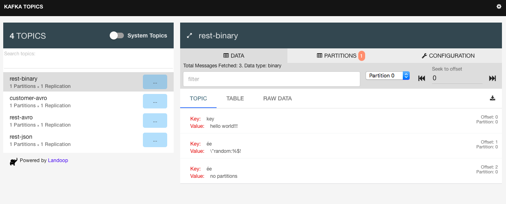

### Consumer binary
- Create consumer
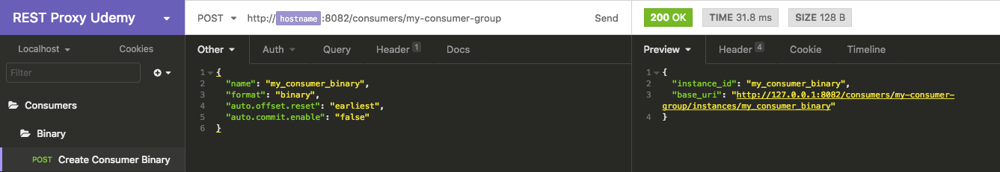

- Subscribe
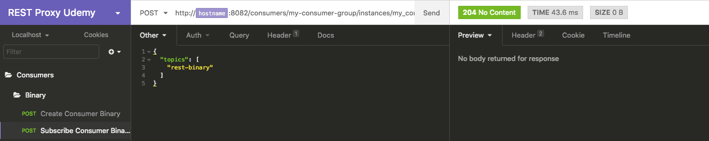

- Consume
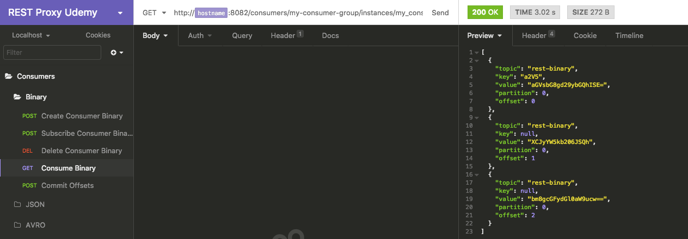

- Consume offset
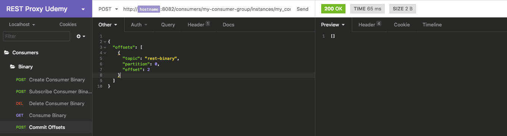


### Producer JSON

- Send JSON
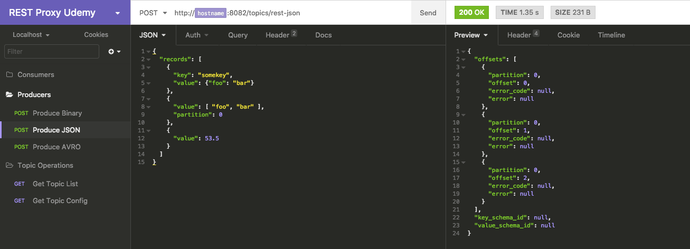

- Data in topic binary http://localhost:3030/kafka-topics-ui/#/cluster/fast-data-dev/topic/n/rest-json/
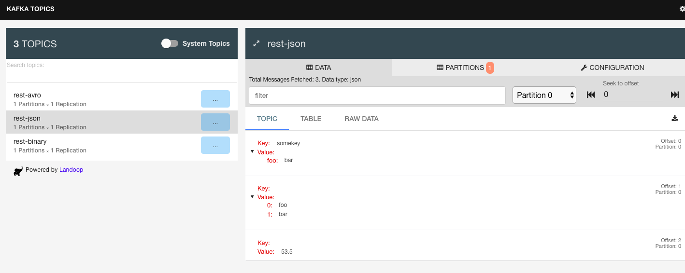

### Consumer JSON

- Create consumer
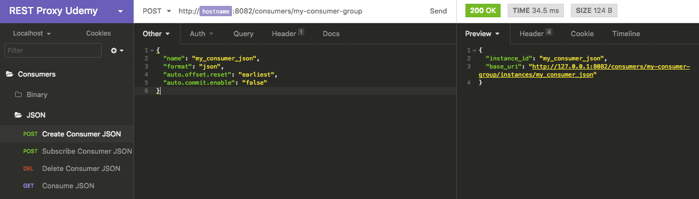

- Subscribe
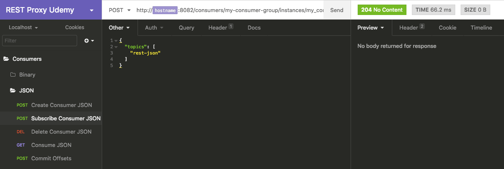

- Consume
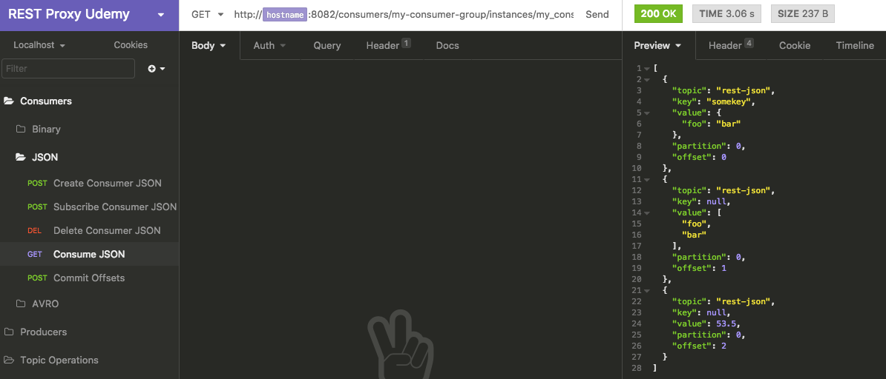


- Consume offset
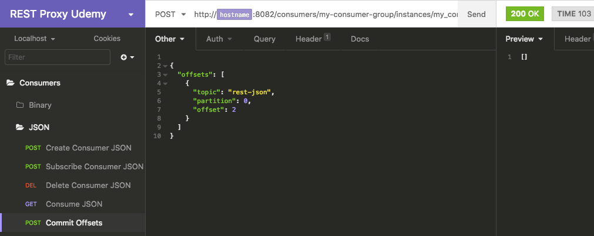


### Producer Avro

- Send Avro
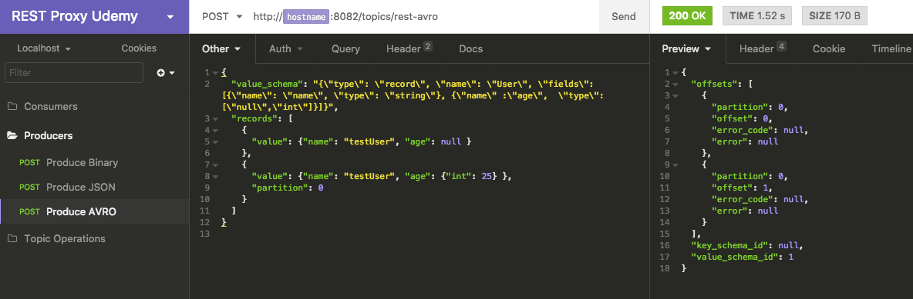

- Send Avro Schema ID
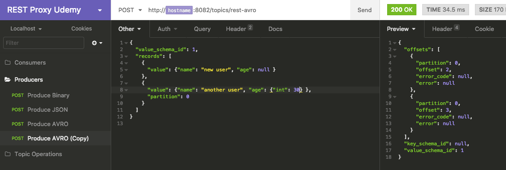

- Data in topic binary http://localhost:3030/kafka-topics-ui/#/cluster/fast-data-dev/topic/n/rest-avro/
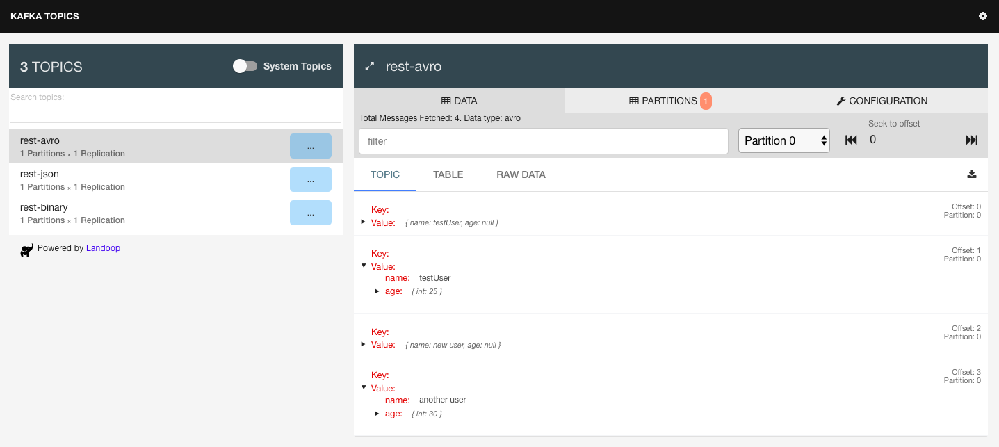

- Schema Registry
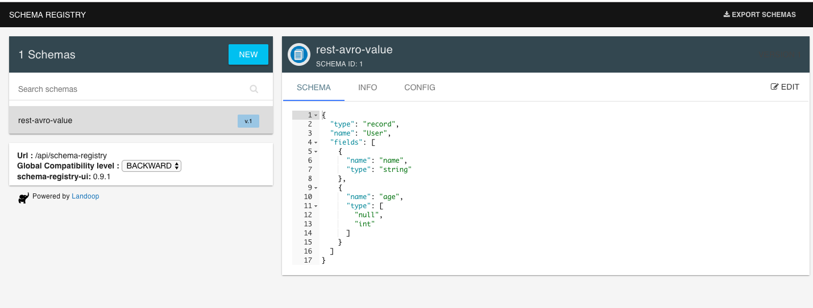

### Consumer Avro

```

$ docker run --rm -it -v "$(pwd)":/tutorial --net=host landoop/fast-data-dev bash

root@fast-data-dev / $ kafka-avro-console-consumer --bootstrap-server 127.0.0.1:9092 --property schema.registry.url=http://127.0.0.1:8081 --topic rest-avro --from-beginning
{"name":"testUser","age":null}
{"name":"testUser","age":{"int":25}}
{"name":"new user","age":null}
{"name":"another user","age":{"int":30}}

```

- Create consumer
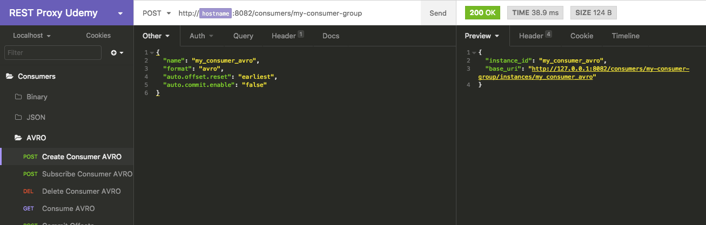

- Subscribe
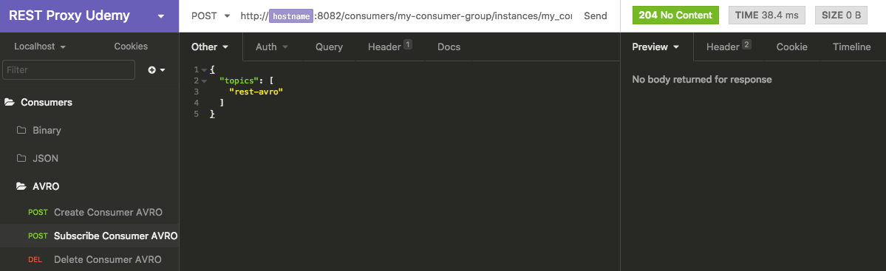

- Consume
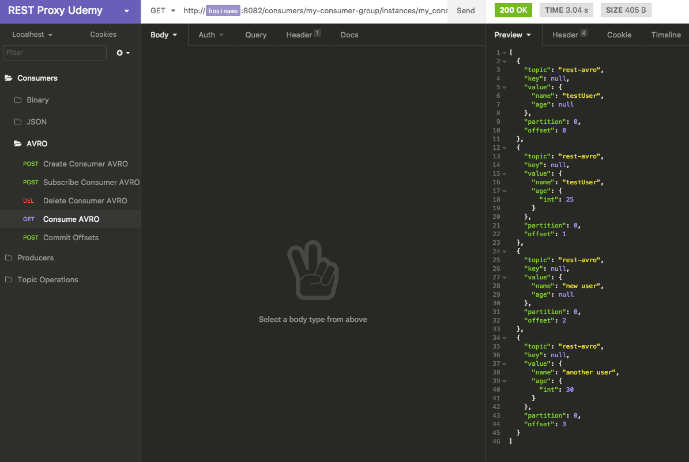

- Consume offset
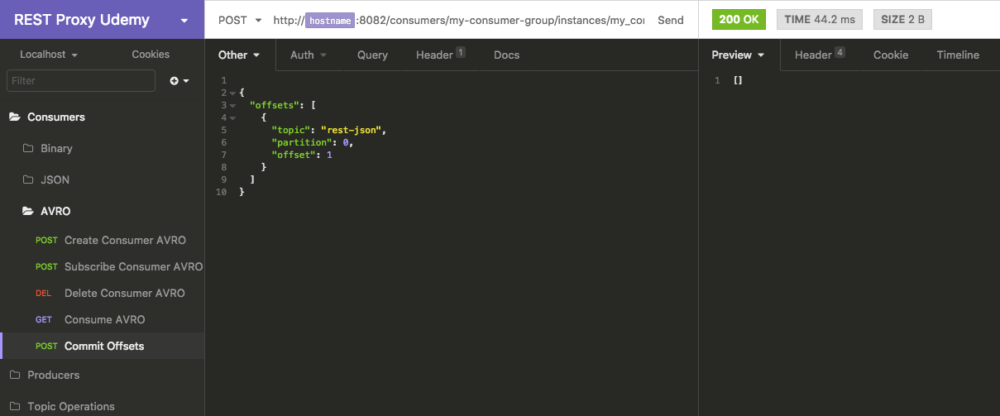
