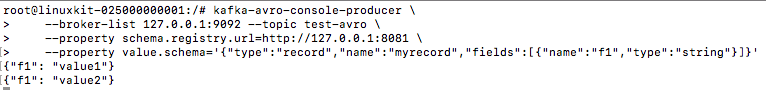
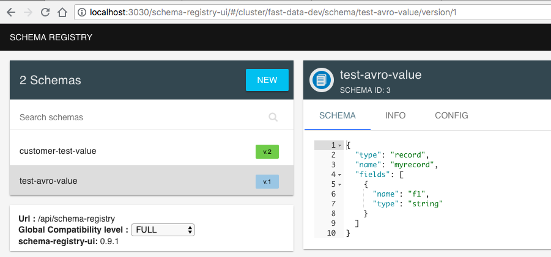
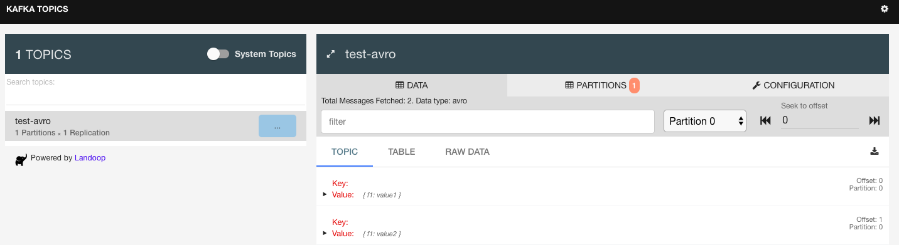
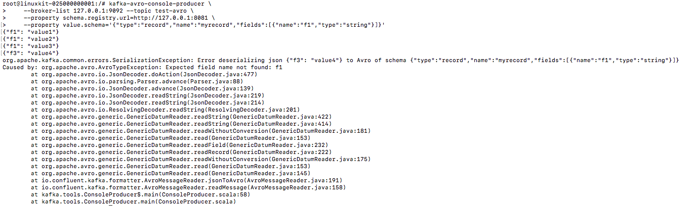
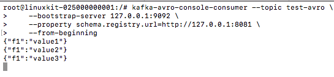
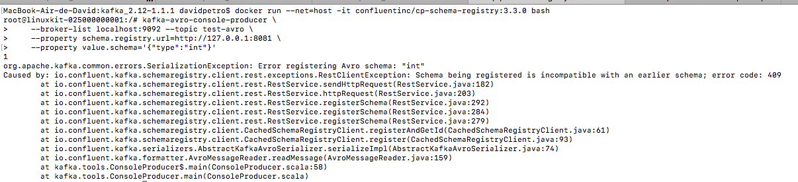
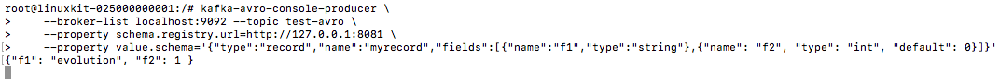
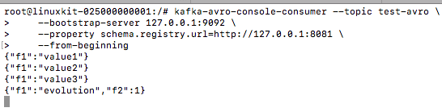

# schema-registry

### 1
docker-compose up

### 2
docker run --net=host -it confluentinc/cp-schema-registry:3.3.0 bash

### Produce a record with one field
kafka-avro-console-producer \
    --broker-list 127.0.0.1:9092 --topic test-avro \
    --property schema.registry.url=http://127.0.0.1:8081 \
    --property value.schema='{"type":"record","name":"myrecord","fields":[{"name":"f1","type":"string"}]}'

### put somes datas
{"f1": "value1"}
{"f1": "value2"}

### automatically create topic schema test-avro 
- http://localhost:3030/schema-registry-ui/#/ 

### automatically create topic test-avro
- http://localhost:3030/kafka-topics-ui/#/cluster/fast-data-dev/topic/n/test-avro/

### put more datas
{"f1": "value3"}

### put a field does not exist
- {"f3": "value4"}

### put wrong type
- {"f1": 1}

### Consume the records from the beginning of the topic:
kafka-avro-console-consumer --topic test-avro \
    --bootstrap-server 127.0.0.1:9092 \
    --property schema.registry.url=http://127.0.0.1:8081 \
    --from-beginning

### Produce some errors with an incompatible schema (we changed to int) - should produce a 409
kafka-avro-console-producer \
    --broker-list localhost:9092 --topic test-avro \
    --property schema.registry.url=http://127.0.0.1:8081 \
    --property value.schema='{"type":"int"}'

### Some schema evolution (we add a field f2 as an int with a default)
kafka-avro-console-producer \
    --broker-list localhost:9092 --topic test-avro \
    --property schema.registry.url=http://127.0.0.1:8081 \
    --property value.schema='{"type":"record","name":"myrecord","fields":[{"name":"f1","type":"string"},{"name": "f2", "type": "int", "default": 0}]}'

- put this data
{"f1": "evolution", "f2": 1 }

### Consume the records again from the beginning of the topic:
kafka-avro-console-consumer --topic test-avro \
    --bootstrap-server localhost:9092 \
    --from-beginning \
    --property schema.registry.url=http://127.0.0.1:8081

